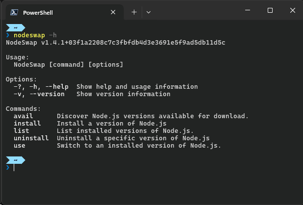

# NodeSwap

NodeSwap is a Windows-only version manager for [Node.js][1], similar to NVM.

[1]: https://nodejs.org/

## Installing and Updating

> ### ⚠ Prerequisites: 
> - **Minimum of .NET 8.0**
>   - There's a good chance you already have this on modern Windows.
>   - If not, download & install at least [.NET 8.0][2].
> 
> - **Existing Node.js installations:**  
>   - Be sure to uninstall any existing Node.js installations.
>   - Remove `%AppData%\npm` to prevent global module conflicts.

### Install NodeSwap
Download and run the latest installer from the [Releases][3] page.

### Upgrade NodeSwap
Download and run the latest installer from the [Releases][3] page.

[2]: https://dotnet.microsoft.com/download
[3]: https://github.com/simshaun/NodeSwap/releases

## Usage

> ### ⚠ Admin rights: 
> **NodeSwap** needs to be ran in an elevated terminal (i.e. Run as Administrator).  
> It needs this in order to create symlinks when installing and swapping Node.js versions. 

Type `nodeswap` in your terminal for help. 

### Commands:

- `nodeswap` — Provides an overview of commands
- `nodeswap list` — List the Node.js installations.
- `nodeswap avail [<min>]` — List the versions available for download. A minimum
                             version can be specified to reduce the amount of output.
- `nodeswap install <version>` — The version can be `latest`, a specific version
                                 like `22.6.0`, or a fuzzy version like `22.6` or `22`.
- `nodeswap uninstall <version>` — The version must be specific like `22.6.0`.
- `nodeswap use <version>` — Switch to a specific version. Must be specific like `22.6.0`.

  
## How-to

### Change where NodeSwap stores Node.js installations:
NodeSwap utilizes an environment var named `NODESWAP_STORAGE`. Simply update it
with a new path. 

> Be sure the path actually exists. NodeSwap does not create it for you.

## Issues & Feature Requests

- Please report in the [Issue Tracker](https://github.com/simshaun/NodeSwap/issues).

## License

MIT
